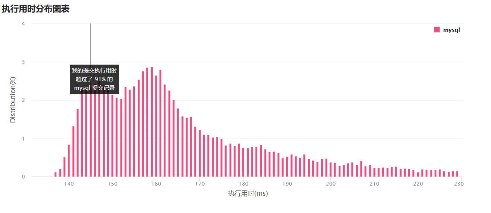

# 176. 第二高的薪水

### 题目链接

https://leetcode-cn.com/problems/second-highest-salary/


### 表结构

```bash
# Salary
+----+--------+
| Id | Salary |
+----+--------+
| 1  | 100    |
| 2  | 200    |
| 3  | 300    |
+----+--------+

来源：力扣（LeetCode）
链接：https://leetcode-cn.com/problems/second-highest-salary
著作权归领扣网络所有。商业转载请联系官方授权，非商业转载请注明出处。
```


### 问题描述

编写一个 SQL 查询，获取 `Employee` 表中第二高的薪水（Salary） 

```bash
+----+--------+
| Id | Salary |
+----+--------+
| 1  | 100    |
| 2  | 200    |
| 3  | 300    |
+----+--------+

来源：力扣（LeetCode）
链接：https://leetcode-cn.com/problems/second-highest-salary
著作权归领扣网络所有。商业转载请联系官方授权，非商业转载请注明出处。
```


### 我的解法

#### 解法一

第二高就是max( Salary < max(Salary) )，即从小于最大值的结果集里面，继续选择最大值，就能得到第二大的值，这个方法还有一个优势就是避免了值重复的筛选过程

```sql
select max(Salary) SecondHighestSalary 
from Employee
where Salary < (
    select max(Salary)
    from Employee
)
```

这是最快的方案



### 解法二

第二高其实就是选择不同的薪水值降序排序，然后返回第二个值，用到的知识点是

`LIMIT row_num,offset`

但是会出现表只有一行数据我们取第二行数据，结果集为空

mysql使得结果集为空，我能想到的解决办法就是将之前的结果作为嵌套表，然后去取它薪水的最大值，如果不存在就是空，否则会返回值

```sql
select max(Salary) as SecondHighestSalary 
from (
    select distinct Salary
    from Employee
    order by Salary desc
    limit 1,1
) A
```


这种方法比较慢