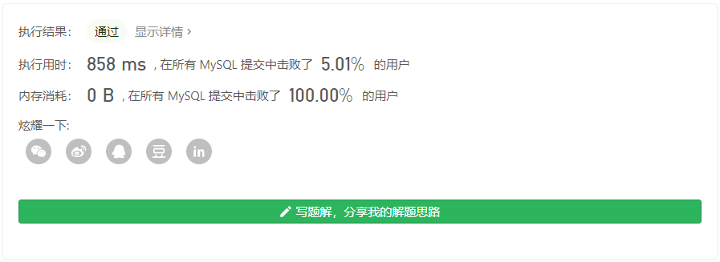
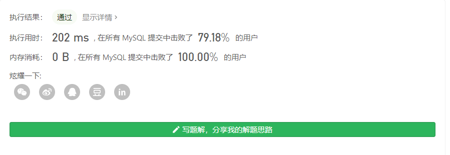

# 178. 分数排名

### 题目链接

https://leetcode-cn.com/problems/rank-scores/


### 表结构

```bash
+----+-------+
| Id | Score |
+----+-------+
| 1  | 3.50  |
| 2  | 3.65  |
| 3  | 4.00  |
| 4  | 3.85  |
| 5  | 4.00  |
| 6  | 3.65  |
+----+-------+

来源：力扣（LeetCode）
链接：https://leetcode-cn.com/problems/rank-scores
著作权归领扣网络所有。商业转载请联系官方授权，非商业转载请注明出处。
```


### 问题描述

编写一个 SQL 查询来实现分数排名。

如果两个分数相同，则两个分数排名（Rank）相同。请注意，平分后的下一个名次应该是下一个连续的整数值。换句话说，名次之间不应该有“间隔”。

```bash
+-------+------+
| Score | Rank |
+-------+------+
| 4.00  | 1    |
| 4.00  | 1    |
| 3.85  | 2    |
| 3.65  | 3    |
| 3.65  | 3    |
| 3.50  | 4    |
+-------+------+

来源：力扣（LeetCode）
链接：https://leetcode-cn.com/problems/rank-scores
著作权归领扣网络所有。商业转载请联系官方授权，非商业转载请注明出处。
```


### 我的解法

#### 解法一

解法一虽然是我写的但是当时参考了题解里面的知识，select 后面的列可以嵌套结果集

这个方法实际上相当于两层for循环

外面是按照Score遍历`Scores`的，然后内部的Score是计算每个外循环遍历的Score值有多少个不重复的值比它大，从而得到它的排名

最后，将得到的结果按照Score从大到小排列

```sql
select 
	Score,
	(
        select count(distinct S2.Score) 
        from Scores S2 
        where S2.Score >= S1.Score 
	) as 'Rank'
from Scores S1
order by Score desc
```



#### 解法二

第二种解法就不是双重循环了，而是表连接之后排序

这里主要考察了`RANK()`的使用方法，具体方法参考

https://blog.csdn.net/u011726005/article/details/94592866


```sql
select A.Score Score, B.my_rank 'Rank'
from (
    select Score
    from Scores
    order by Score desc
) A left join (
    select Score,rank() over(order by Score desc) as my_rank
    from Scores
    group by Score
) B
on A.Score = B.Score
order by A.Score desc
```



#### 解法三

`dense_rank()`

这题应该就是考察`dense_rank()`的使用

```sql
select Score, dense_rank() over(order by Score desc) 'Rank'
from Scores
order by Score desc
```

