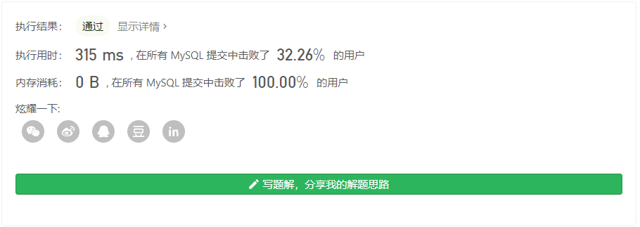
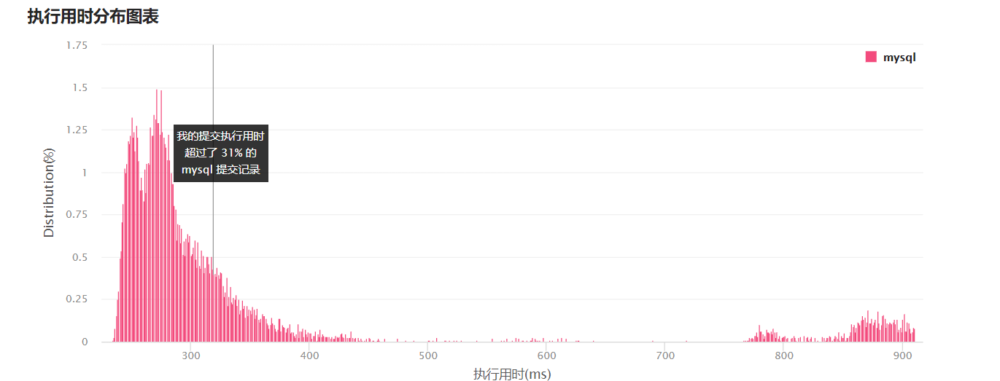

# 181. 超过经理收入的员工

### 题目链接

https://leetcode-cn.com/problems/employees-earning-more-than-their-managers/


### 表结构

```bash
+----+-------+--------+-----------+
| Id | Name  | Salary | ManagerId |
+----+-------+--------+-----------+
| 1  | Joe   | 70000  | 3         |
| 2  | Henry | 80000  | 4         |
| 3  | Sam   | 60000  | NULL      |
| 4  | Max   | 90000  | NULL      |
+----+-------+--------+-----------+

来源：力扣（LeetCode）
链接：https://leetcode-cn.com/problems/employees-earning-more-than-their-managers
著作权归领扣网络所有。商业转载请联系官方授权，非商业转载请注明出处。
```


### 问题描述

给定 `Employee` 表，编写一个 SQL 查询，该查询可以获取收入超过他们经理的员工的姓名。在上面的表格中，Joe 是唯一一个收入超过他的经理的员工。

```bash
+----------+
| Employee |
+----------+
| Joe      |
+----------+
```


### 我的解法

#### 解法一

首先想到的解法

```sql
select e1.Name 'Employee'
from Employee e1, Employee e2
where e1.ManagerId = e2.Id and e1.Salary > e2.Salary
```




#### 解法二

表联结

```sql
select e1.Name 'Employee'
from Employee e1 left join Employee e2
on e1.ManagerId = e2.Id
where e1.Salary > e2.Salary
```



感觉执行时间波动太大了，一点不准