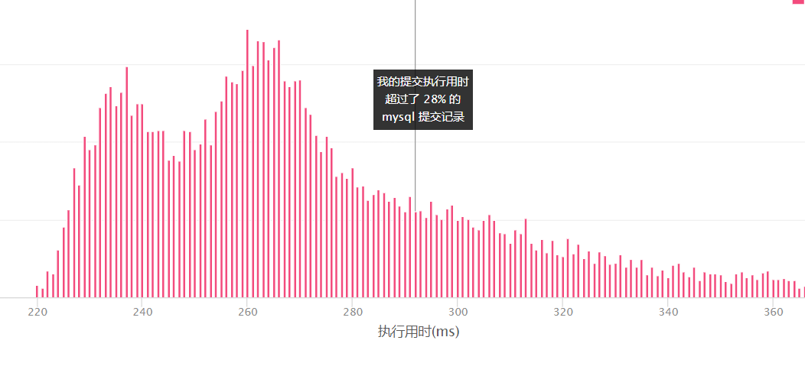

# 182. 查找重复的电子邮箱

### 题目链接

https://leetcode-cn.com/problems/duplicate-emails/


### 表结构

```bash
+----+---------+
| Id | Email   |
+----+---------+
| 1  | a@b.com |
| 2  | c@d.com |
| 3  | a@b.com |
+----+---------+

来源：力扣（LeetCode）
链接：https://leetcode-cn.com/problems/duplicate-emails
著作权归领扣网络所有。商业转载请联系官方授权，非商业转载请注明出处。
```


### 问题描述

编写一个 SQL 查询，查找 `Person` 表中所有重复的电子邮箱。


### 我的解法

#### 解法一

首先能想到的解法是`having count`

```sql
select Email
from Person
group by Email
having count(Email) > 1
```



#### 解法二

```sql

select b.Email
from (
    select Email,count(Email) num
    from Person
    group by Email
) b
where b.num > 1
```

